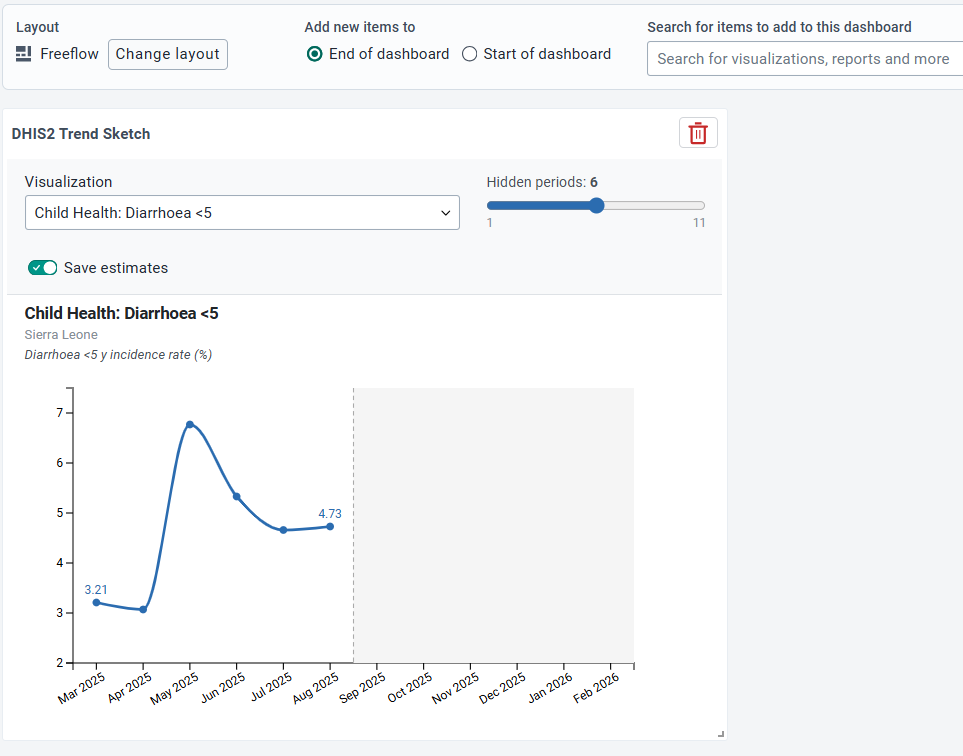

# DHIS2 Trend Sketch

A dashboard plugin for the DHIS2 platform that tests users' intuitions about health data trends.

## What it does

Trend Sketch presents a line chart from any existing DHIS2 visualization, but hides the most recent periods. The user draws their expected values freehand by clicking and dragging across the hidden portion of the chart. Once the drawing is complete, the true values are revealed with a left-to-right animation, and two accuracy metrics are displayed: Euclidean distance (how far off the drawn line was in absolute terms) and Pearson correlation (how well the drawn shape matched the true trend).

## Use cases

- **Training and awareness**: Help health programme staff develop an intuitive sense of how their indicators are moving over time, before seeing the actual data.
- **Data review meetings**: Use as an interactive and gamified opener, to engage teams with their own data and prompt discussion about what drove unexpected results.
- **Forecasting calibration**: Allow analysts or managers to record their prior expectations, then compare against actuals to identify systematic biases and hidden information. Priors which are captured and encoded through the app can be used to recalibrate forecasting models.

## How to use

### Installation
- Upload the app manually to your DHIS2 instance in App Management app.
- Add the trend-sketch permission to your admin user role and user role for all dashboard end users.
- Open and edit a dashboard. Add the plugin like any other visualization. You may configure multiple plugins separately on a single dashboard.

### Use 
In dashboard **edit mode**, select any saved _line visualization_ from the dropdown of the plugin. The visualization must have 3–12 periods on the x-axis, a single data dimension, and a single organisation unit. Relative periods and user org units are allowed, such as "last 6 months" or "User org unit". Use the hidden periods slider to control how many recent periods the user will draw.

In dashboard **view mode**, the configuration controls are hidden and the user sees only the visible portion of the chart. They draw the remaining values freehand, then the true line is revealed along with their accuracy scores.

### Save Estimates
When in **edit mode** select "save estimates" enables comparison of estimates. 

When in **view mode**, the user then clicks "submit estimate" before viewing the remaining values. Their guesses and accuracy scores are shown. When clicking "compare to others", the last 10 estimates are also plotted, along with the mean of all estimates and ± 1 SD band.

All submitted estimates, along with user info and accuracy scores, are saved to the instance datastore under trend-sketch namespace and *the context scope* key, which is defined as:
 [visualiation_id]_[orgunut_id]_[startperiod]_[endperiod]
Thus, if a plugin is defined with user org units and/or relative periods, a different context scope is defined for every period or user org unit combination which submits data.

To remove prior estimates, go to data store and delete the values submitted to datastore.

---

This project was bootstrapped with [DHIS2 Application Platform](https://github.com/dhis2/app-platform).

## Available Scripts

In the project directory, you can run:

### `yarn start`

Runs the app in the development mode. 
Open [http://localhost:3000](http://localhost:3000) to view it in the browser.

The page will reload if you make edits. 
You will also see any lint errors in the console.

### `yarn test`

Launches the test runner and runs all available tests found in `/src`. 

See the section about [running tests](https://developers.dhis2.org/docs/app-platform/scripts/test) for more information.

### `yarn build`

Builds the app for production to the `build` folder. 
It correctly bundles React in production mode and optimizes the build for the best performance.

The build is minified and the filenames include the hashes. 
A deployable `.zip` file can be found in `build/bundle`!

See the section about [building](https://developers.dhis2.org/docs/app-platform/scripts/build) for more information.

### `yarn deploy`

Deploys the built app in the `build` folder to a running DHIS2 instance. 
This command will prompt you to enter a server URL as well as the username and password of a DHIS2 user with the App Management authority. 
You must run `yarn build` before running `yarn deploy`. 

See the section about [deploying](https://developers.dhis2.org/docs/app-platform/scripts/deploy) for more information.

## Learn More

You can learn more about the platform in the [DHIS2 Application Platform Documentation](https://developers.dhis2.org/docs/app-platform/getting-started).

You can learn more about the runtime in the [DHIS2 Application Runtime Documentation](https://developers.dhis2.org/docs/app-runtime/getting-started).

To learn React, check out the [React documentation](https://reactjs.org/).
